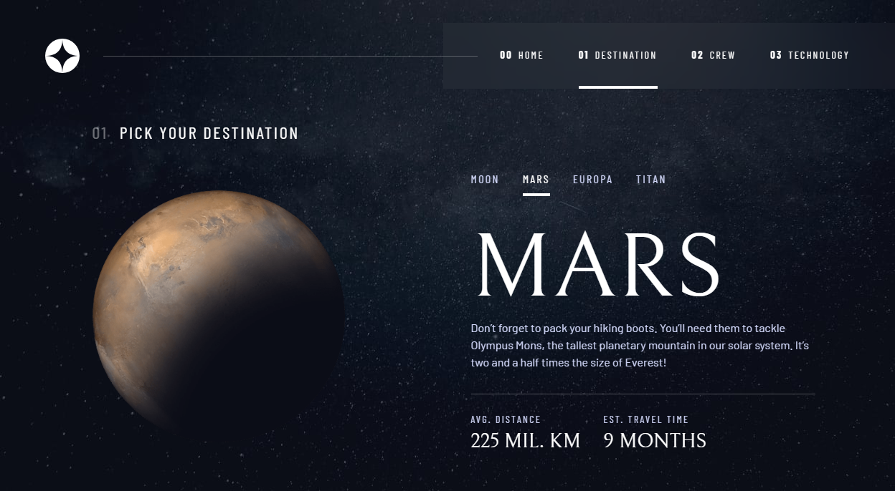
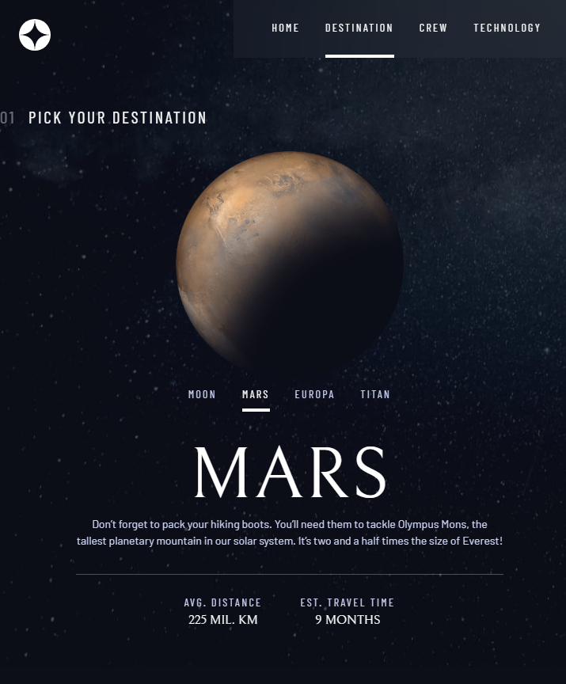
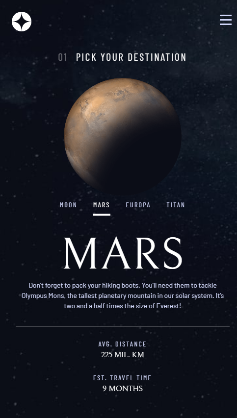

# Frontend Mentor - Space tourism website solution

This is a solution to the [Space tourism website challenge on Frontend Mentor](https://www.frontendmentor.io/challenges/space-tourism-multipage-website-gRWj1URZ3). Frontend Mentor challenges help you improve your coding skills by building realistic projects. 

## Table of contents

- [Overview](#overview)
  - [The challenge](#the-challenge)
  - [Screenshot](#screenshot)
  - [Links](#links)
- [My process](#my-process)
  - [Built with](#built-with)
  - [What I learned](#what-i-learned)
  - [Continued development](#continued-development)
- [Author](#author)
- [Acknowledgments](#acknowledgments)

## Overview

### The challenge

Users should be able to:

- View the optimal layout for each of the website's pages depending on their device's screen size
- See hover states for all interactive elements on the page
- View each page and be able to toggle between the tabs to see new information

### Screenshot





### Links

- Solution URL: [Add solution URL here](https://your-solution-url.com)
- Live Site URL: [Add live site URL here](https://your-live-site-url.com)

## My process

### Built with

- Semantic HTML5 markup
- HTML Assessibility tags
- CSS custom properties
- Flexbox
- CSS Grid
- Desktop-first workflow
- [Google Fonts](https://fonts.googleapis.com/css2?family=Barlow+Condensed:wght@400;700&family=Bellefair&family=Barlow:wght@400;700&display=swap) - For Fonts

### What I learned

I learnt a lot through this project.
this is my first time using some accessibity and aria features such as aria-control, aria-label, aria-hidden etc. I also learnt how to use the 'data-' feature.

I learn new styling poperties like cramp, minmax, etc. For example, clamp can be used to set a font size to change throught the device sizes.
```css
h1{
  font-size: clamp(90px, 10vw, 150px);
}
```

I also learnt how to use @support to implement stying that might not work on all devices, like 'backdrop'. see example below;

```css
@supports (backdrop-filter: blur(1.5rem)){
    .navigation{
        background: hsla(0, 0%, 100%, 0.034);
        backdrop-filter: blur(1.5rem)
    }
}
```

I also learnt how to call a clicked event and also trace it back to its parent up to the body 
```js
function changeContent(e){
    const targetTab = e.target;     //clicked tab
    const targetArticle = targetTab.getAttribute("aria-controls");  //Clicked tab's article
    const targetImages = targetTab.getAttribute("data-image");  //Clicked tab's image

    const tabContainer = targetTab.parentNode;
    const sectionContainer = tabContainer.parentNode;
    const mainContainer = sectionContainer.parentNode;
}
```

### Continued development

Still trying to wrap my head around using some of the Javascript selector like this - [`#${targetArticle}`]). I still have a lot to improve on in javascript.


### Useful resources

- [Example resource 1](https://www.example.com) - This helped me for XYZ reason. I really liked this pattern and will use it going forward.
- [Example resource 2](https://www.example.com) - This is an amazing article which helped me finally understand XYZ. I'd recommend it to anyone still learning this concept.


## Author

- GitHub - [Udeh Ifeanyi](https://github.com/Ifescohub)
- Frontend Mentor - [@ifescohub](https://www.frontendmentor.io/profile/Ifescohub)
- Twitter - [@UdehIfeanyi10](https://twitter.com/UdehIfeanyi10)

## Acknowledgments

A big thanks to Kevin Powell on Scrimba.com. His lecture really helped me alot before I started this challenge.


